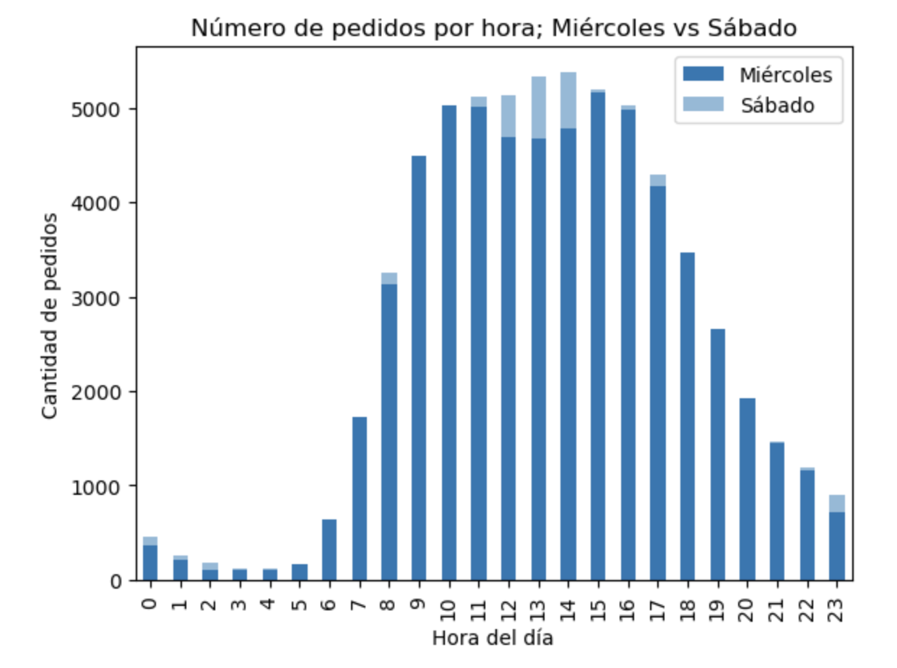
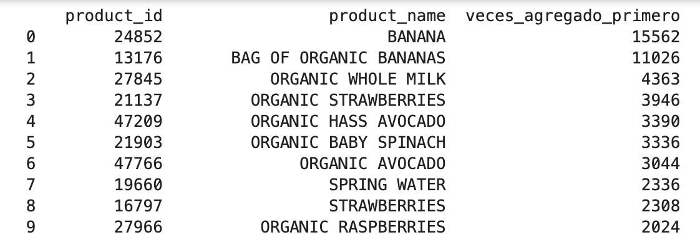
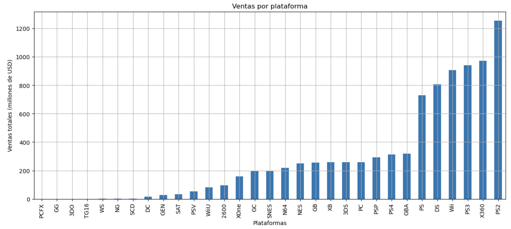

# Leslie Carolina Páez Balderas

**Junior Data Analyst | SQL • Tableau • Python • Excel**

[LinkedIn](https://www.linkedin.com/in/leslie-carolina-p%C3%A1ez-balderas/) ·
[Tableau Public](https://public.tableau.com/app/profile/leslie.p.ez/vizzes) ·
[Email](mailto:leslie.pabal6@gmail.com) ·
[GitHub](https://github.com/caropaez64)

---

## Sobre mí

En la licenciatura aprendí que toda obra literaria tiene una estructura; en el análisis de datos descubrí que esa estructura también revela patrones y decisiones estratégicas.

Soy **Data Analyst Junior en transición hacia el análisis de datos**, proceso que comenzó durante mi **Maestría en Administración**, donde identifiqué el valor del análisis de información en la toma de decisiones empresariales. Trabajo con **SQL, Tableau, Python y Excel** para limpiar datos, analizar desempeño y comunicar insights con dashboards claros y visualmente atractivos.

Me interesa desarrollarme en **Business Intelligence, análisis comercial y calidad de datos** dentro de corporativos grandes y multinacionales (incluyendo farmacéuticas).  
📩 Estoy abierta a oportunidades, conectar y aprender cosas nuevas.

---

## Proyectos seleccionados

### 1) Ventas globales — Dashboard (Tableau)

**Objetivo:** explorar ventas globales y comunicar insights con un dashboard interactivo.  
**Qué hice:**
- Diseñé visualizaciones, filtros y métricas para analizar tendencias por país/región/periodo/tipo de producto.
- Apliqué **data storytelling** para destacar hallazgos de negocio.

**Herramientas:** Tableau Public  
**Ver dashboard:** https://public.tableau.com/app/profile/leslie.p.ez/viz/EntregaFinalPez/Nubepalabras

---

### 2) Instacart — Hábitos de compra (Python / EDA)

**Objetivo:** limpiar un dataset modificado y analizar hábitos de compra (horarios, días, reorden y productos top).  
**Qué hice:**
- Limpieza: tipos, ausentes, duplicados y validación de rangos.
- EDA + visualizaciones para responder preguntas de negocio sobre comportamiento y reorden.

**Herramientas:** Python (Pandas, Matplotlib), Jupyter  

**Visualizaciones:**

**Hallazgos clave:**
- Mayor actividad entre **9:00–17:00** (pico **10:00**).
- Más compras: **domingo y lunes**; menos: **jueves**.
- Producto #1: **banana** (**66,050** compras).

**Entregables:**
- ✅ [Reporte HTML](projects/instacart/instacart_report.html)  
- ✅ [Notebook (Jupyter)](projects/instacart/instacart_public.ipynb)

---

### 3) Tienda Ice (Videojuegos) — Perfil de usuario por región + pruebas de hipótesis

**Objetivo:** construir un perfil de usuario por región y validar hipótesis para apoyar decisiones de marketing/contenido.  
**Qué hice:**
- Limpieza/estandarización y análisis por región (plataformas, géneros y rating ESRB).
- Pruebas de hipótesis sobre calificaciones de usuarios por plataforma y género.

**Herramientas:** Python (Pandas, Matplotlib), estadística (pruebas de hipótesis), Jupyter  

**Visualizaciones:**

**Hallazgos clave:**
- **Norteamérica:** X360 + Action + Rating **E**  
- **Europa:** PS3 + Action + Rating **E**  
- **Japón:** DS + Role-playing + Rating **E**
- Diferencia en calificaciones promedio **Xbox One vs PC**; sin evidencia suficiente para diferencia **Action vs Sports**.

**Entregables:**
- ✅ [Reporte HTML](projects/tienda_ice/tienda_ice_report.html)  
- ✅ [Notebook (Jupyter)](projects/tienda_ice/tienda_ice_public.ipynb)

---

## Habilidades

- **SQL:** joins, agregaciones, filtros, análisis exploratorio  
- **Tableau:** dashboards, filtros, data storytelling  
- **Python:** limpieza, EDA, visualización (Pandas, NumPy, Matplotlib)  
- **Excel:** tablas dinámicas, validación/limpieza, dashboards  

---

## Contacto

📩 **Email:** [leslie.pabal6@gmail.com](mailto:leslie.pabal6@gmail.com)  
🔗 **LinkedIn:** https://www.linkedin.com/in/leslie-carolina-p%C3%A1ez-balderas/  

_Última actualización: Feb 2026_
